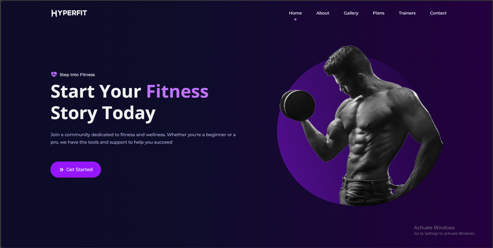

# 🏋️‍♂️ Fitness Website – React, CSS & Framer Motion

## overview
A modern and interactive fitness website built using React.js, CSS, and Framer Motion for smooth animations. This project delivers a seamless user experience with engaging UI elements, motion effects, and responsive design.

## ✨ Features

✅ Framer Motion Animations – Smooth page transitions, section reveals, and interactive elements

✅ Responsive Design – Fully optimized for desktop, tablet, and mobile

✅ Styled with CSS – Clean, modern, and visually appealing layout

✅ Testimonials & FAQs – Dynamic client reviews and common questions section

✅ Interactive UI – Engaging hero sections, call-to-actions, and fitness program showcases

✅ Fast & Lightweight – Optimized for performance and usability

## 🚀 Tech Stack

React.js – Component-based architecture for scalability
CSS – Custom styling for a polished look
Framer Motion – High-performance animations & transitions

## 📸 Preview

## 📂 Installation & Setup

git clone https://github.com/SeneshAnujaya/React-Fitness-Website-with-Framer-Motion.git 
cd fitness-website  
npm install  
npm start 

## 📌 License

This project is open-source and available under the MIT License.
